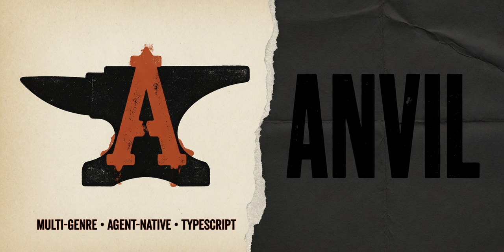

# Anvil

<p align="center">
  
</p>

Anvil is an **agent-native, multi-genre TypeScript game engine** for browser,
headless verification, and desktop shells. Games live beside the engine and
consume public Anvil APIs.

| Path | Role | Current status |
|------|------|----------------|
| [`anvil/`](./anvil/) | Engine and framework | M1–M9 runtime complete; M10/M11 authoring integration in progress |
| [`games/gravewake/`](./games/gravewake/) | ARPG built on Anvil | Active playable campaign and authoring-v2 reference title |

## Start here

- To build a game or inspect the public surface: [`anvil/ENGINE.md`](./anvil/ENGINE.md)
- To change the engine: [`anvil/docs/design/README.md`](./anvil/docs/design/README.md)
- To work as a repository agent: [`AGENTS.md`](./AGENTS.md)
- To use **Grok Build + Grok Imagine** for code and assets: [`docs/GROK_WORKFLOW.md`](./docs/GROK_WORKFLOW.md)
- To understand the current title: [`games/gravewake/README.md`](./games/gravewake/README.md)

## Development setup

Requires Node.js 22 or newer and pnpm 9.15.9.

```bash
cd anvil
pnpm install
pnpm -r run build
pnpm test
pnpm lint
pnpm validate:examples
pnpm test:examples
```

`pnpm test` is the established M1–M9 suite. Until the M10/M11 integration
tasks are finished, run their package tests separately:

```bash
pnpm --filter @anvil/authoring --filter @anvil/genre-arpg test
```

The complete `pnpm check` gate is intentionally not described as green: the
current checkout has three failing CLI integration tests for unfinished
schema-v2 scaffolding and commands. See
[`anvil/docs/design/18_TESTING_AND_CI.md`](./anvil/docs/design/18_TESTING_AND_CI.md).
