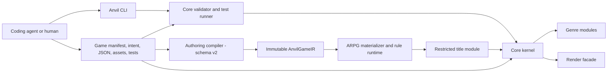

# 04 — System architecture

Anvil separates safe declarative source, host-side compilation, deterministic
runtime services, genre rules, title code, and rendering. The schema-v1 path
can go directly from manifest/content to the runtime; schema-v2 projects first
compile to immutable IR.

## Context



The current generic CLI does not yet connect the compiler/ARPG boxes. Gravewake
does so explicitly in its Node and Vite host boundaries.

## Package view

```mermaid
flowchart TD
  Schema[@anvil/schema]
  Core[@anvil/core]
  Authoring[@anvil/authoring]
  Genres[@anvil/genre-card, topdown2d, vn, shmup, fps2]
  Arpg[@anvil/genre-arpg]
  LegacyNet[@anvil/genre-net]
  Colyseus[@anvil/net-colyseus]
  Renderer[@anvil/render-phaser]
  Recipes[@anvil/recipes]
  CLI[@anvil/cli]
  Desktop[@anvil/desktop]
  Games[examples and games]

  Core --> Schema
  Authoring --> Schema
  Genres --> Core
  Genres --> Schema
  Arpg --> Core
  Arpg --> Schema
  Arpg --> Topdown[@anvil/genre-topdown2d]
  LegacyNet --> Core
  Colyseus --> Core
  Renderer --> Core
  CLI --> Core
  CLI --> Schema
  CLI --> Recipes
  Games --> Core
  Games --> Genres
  Games --> Arpg
  Games -. host only .-> Authoring
  Desktop --> Games
```

## Runtime components

| Component | Responsibility |
|-----------|----------------|
| Kernel/GameHandle | Fixed-step scheduling, service lifetime, public runtime handle |
| World | Entity storage and queries |
| SceneManager | Scene stack and lifecycle |
| ModuleRegistry | Genre/module registration and systems/scenes |
| InputMap | Semantic actions, keyboard/gamepad bindings, edge latching |
| EventBus | Typed-by-convention system decoupling |
| AssetServer | Root-safe lookup and deterministic greybox handles |
| RenderFacade | Renderer-neutral drawing and capture |
| Observe/agent ACI | Snapshot, summary, semantic step, diff, replay |
| RPG/combat services | Character, items, resources, abilities, statuses, projectiles, death, etc. |
| Authoring compiler | Intent/content parsing, composition, diagnostics, canonical frozen IR |
| ARPG layer | IR materialization, finite rules, restricted title hook |

## Dependency and ownership rules

| Layer | May depend on | Must not own/import |
|-------|---------------|---------------------|
| Declarative game content | Schema-defined JSON/YAML concepts | Executable code, absolute paths, renderer internals |
| Game host/build boundary | Public Anvil packages, authoring compiler | Phaser, kernel internals |
| Title runtime module | Core/genre public APIs | Renderer, `KernelInternals`, scheduler, scene registration through restricted ARPG hook |
| Genre modules | Core and schema; ARPG also topdown2d | Title content or title lore |
| Core | Schema and render-facade interface | A particular game or Phaser |
| CLI | Core, schema, recipes; authoring after pending M10 wiring | Hard-coded title behavior |
| Phaser backend | Core facade types | Game content decisions |

Game code may import `@anvil/core`, appropriate `@anvil/genre-*` packages, and
schema/authoring at safe host boundaries. Only `@anvil/render-phaser` may import
Phaser.

## Deployment views

### Schema-v1 development

```text
agent → CLI → validate/test or Vite → core + built-in genre → facade
```

### Schema-v2 Gravewake development

```text
Node tests: files → compileProject → IR → materialize → title module → core
Browser:    files → Vite host plugin → virtual IR → materialize → title module
```

### CI

The current workflow builds, lints, runs the configured package suite, checks
recipes, builds selected examples, and validates/tests Gravewake and all hello
examples. See [`18_TESTING_AND_CI.md`](./18_TESTING_AND_CI.md) for known path and
M10/M11 coverage gaps.

## Safety properties

- Project paths are resolved inside declared roots.
- Declarative authoring never executes content as code.
- Recipes describe game-root files and do not run privileged commands.
- Tests use deterministic seeds and fixed timesteps.
- Authoring output excludes timestamps and absolute paths.
- No image-generation API is part of the engine.
