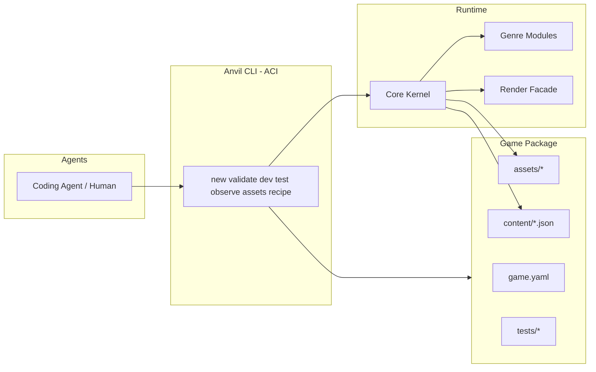
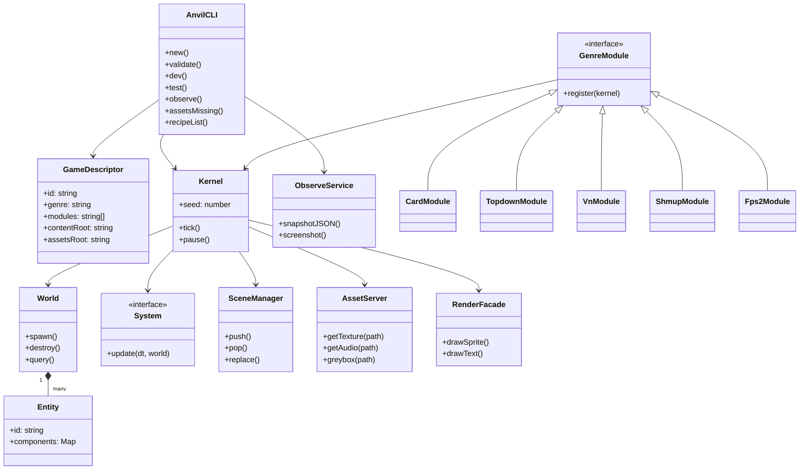

# 04 — System Architecture

**Research:** GC desiderata; DG submodule pattern; SW ACI; LR high-level API.

## 1. Context diagram



## 2. Package UML (logical)



## 3. Layering rules

| Layer | May depend on | Must not depend on |
|-------|---------------|--------------------|
| Game package content | schemas only | Phaser, kernel internals |
| Genre modules | core | other genres (except via events) |
| Core | render facade interface | game content |
| CLI | core + schema + recipes | game-specific code |
| Render backend (Phaser) | nothing above | — |

**Dependency rule (REQ-A03):** game code imports `@anvil/core` and `@anvil/genre-*` only.

## 4. Directory layout (repo)

**Canonical tree:** [`17_MONOREPO_AND_STACK.md`](./17_MONOREPO_AND_STACK.md)  
(includes `render-phaser`, `hello-empty`, `hello-fps2`, `fps2-starter`).

## 5. Component responsibilities

| Component | Responsibility | REQ |
|-----------|----------------|-----|
| CLI | ACI entry | P01–P10 |
| Schema | Zod/JSON Schema validate | P04 |
| Kernel | tick, seed, pause | K01–K02 |
| World | entities/components | K04 |
| Systems | behavior | K05 |
| SceneManager | flow | K03 |
| AssetServer | paths + greybox | K08, S01–S03 |
| Input | action map | K07 |
| Events | decouple systems | K06 |
| ObserveService | agent eyes | P07–P08 |
| TestRunner | headless scenarios | P06 |
| Genre modules | domain rules | G01–G06 |
| Recipes | verified snippets | A05, VY |
| RenderFacade | draw abstraction | K12 |

## 6. Deployment views

### 6.1 Dev (agent loop)

```text
Agent → CLI → Vite dev server → Browser
                ↘ headless test process
```

### 6.2 CI

```text
git push → pnpm test → anvil validate (all examples) → anvil test (all examples)
```

## 7. Security / sandbox (agent safety)

- CLI operates only within project root  
- No privileged host commands in recipes  
- Tests run sandboxed cwd  

(Aligns with agent failure catalogs; keep destructive ops out of ACI.)
