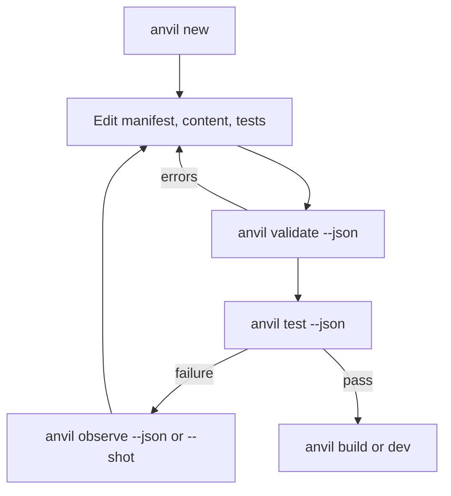

# 05 — Agent-computer interface

The ACI gives a coding agent a small structured loop: discover, validate, test,
act, observe, compare, and replay. It avoids renderer documentation and raw key
codes for standard tasks.

## Principles

1. Keep the required command/tool surface small.
2. Prefer JSON diagnostics with path, hint, expected/actual, and stable code.
3. Use semantic actions and structured state, not canvas scraping alone.
4. Treat tests as the primary success signal; observe after failures and visual
   changes.
5. Do not advertise commands before they appear in live help and pass tests.

## Current CLI surface

Run `pnpm anvil --help` from `anvil/` for the authoritative list.

| Workflow | Commands |
|----------|----------|
| Project lifecycle | `version`, `new`, `validate`, `dev`, `build` |
| Verification | `test`, `observe`, `doctor` |
| Discovery | `tools`, `recipe list/show`, `content list` |
| Asset discovery | `assets missing`, `audio list`, `sprites list` |
| Operations | `net health` |

Full arguments and current limitations are in [`specs/S-CLI.md`](./specs/S-CLI.md).
In particular, `migrate`, `describe`, `capabilities`, and ARPG scaffolding are
planned but absent.

## Canonical loops

### Existing schema-v1 project



### Schema-v2 project today

1. Parse/compile with `compileProject` in the host or title test boundary.
2. Inspect sorted `AnvilError` diagnostics.
3. Materialize the IR for the applicable genre.
4. Run the title's headless scenarios and browser build.
5. Use engine `observe` plus title observation data.

The generic CLI does not yet perform step 1 for the agent.

## Structured programmatic actions

```ts
type AgentAction =
  | { type: "noop" }
  | { type: "move"; dir: "up" | "down" | "left" | "right"; holdFrames?: number }
  | { type: "move_stop" }
  | { type: "press" | "release" | "tap"; action: string }
  | { type: "wait"; frames: number }
  | { type: "set_down"; actions: Record<string, boolean> };
```

`agentStep` advances a live handle; `observeDiff` returns changed positions,
health, entities, scene, and genre summary. `ReplayRecorder` captures version-1
tapes and `playReplay` rejects seed mismatches before replaying them.

## Observe contract

The current `ObserveSnapshot` includes:

- runtime `anvilVersion` and observation `schemaVersion: 1`;
- scene, time, tick, seed, and pause state;
- simplified entities and current semantic input state;
- `genre` and first-class `engine` observations;
- an LLM-friendly `summary` and `allowedActions`; and
- optional screenshot path.

The observation schema version is independent of project `game.yaml`
`schemaVersion`.

## Programmatic API

```ts
import {
  agentStep,
  createGame,
  observe,
  observeDiff,
  playReplay,
  ReplayRecorder,
  runTests,
  validateProject,
} from "@anvil/core";
```

Schema-v2 compiler/migration/capability APIs come from `@anvil/authoring`; the
ARPG materializer/rules/hook come from `@anvil/genre-arpg`.

## Forbidden shortcuts

- importing Phaser in a game or non-render package;
- editing dependencies under `node_modules`;
- treating a successful build as proof that interactions work;
- dumping entire snapshots into prompts when the summary/diff is sufficient;
- inventing title-local versions of reusable engine systems; and
- calling designed but absent M10/M11 CLI commands.
