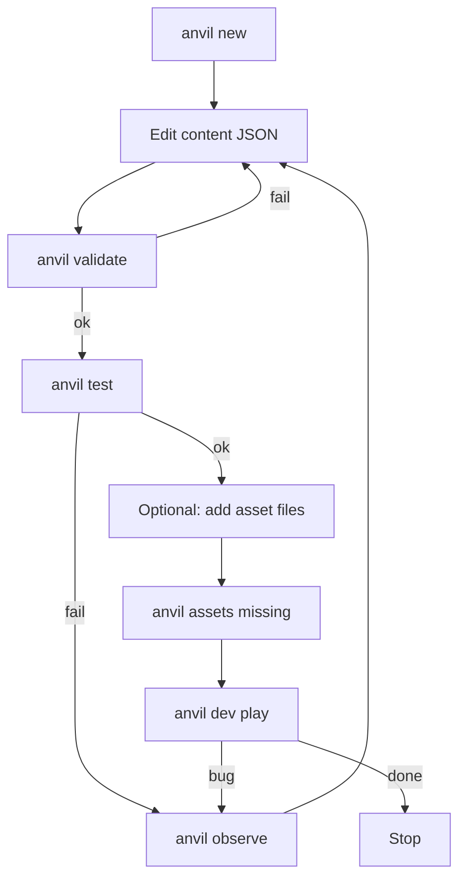

# 05 — Agent–Computer Interface (ACI)

**Research:** SWE-agent (arXiv:2405.15793) — interface design determines agent success.  
GameCraft-Bench §5.1 — bash thrashing ≠ quality; perception-guided iteration helps.

## 1. Design principles

1. **Small surface** — ≤30 commands/tools total for v1 (REQ-A01)  
2. **Structured I/O** — JSON errors with fix hints (REQ-A02)  
3. **Eyes** — observe JSON + screenshot (REQ-P07/P08)  
4. **Verify** — test after edit, not only compile (GC D-III)  
5. **No engine dump** — agents never need Phaser docs for standard games  

## 2. Command catalog (complete v1)

| Command | Args | Output | REQ |
|---------|------|--------|-----|
| `anvil new <name>` | `--genre card\|topdown2d\|vn\|shmup\|fps2` | Creates package | P01 |
| `anvil validate` | `[path]` | OK or error list | P04 |
| `anvil dev` | `[path]` | Dev server URL | P05 |
| `anvil test` | `[path] [--seed N]` | Pass/fail report | P06 |
| `anvil observe` | `[--json] [--shot]` | State + optional PNG | P07–P08 |
| `anvil assets missing` | | List of paths | P09 |
| `anvil recipe list` | | Recipe ids | P10 |
| `anvil recipe show <id>` | | Files to write | P10 |
| `anvil build` | `[path] [--out dir]` | Static web/data build | P05/M6 |
| `anvil version` | | Version string | — |

**Forbidden as required workflow:** ad-hoc `rm -rf`, editing `node_modules`, importing `phaser` in game src.

## 3. Error format (mandatory)

```json
{
  "ok": false,
  "errors": [
    {
      "code": "SCHEMA_INVALID",
      "path": "content/cards/strike.json",
      "message": "Missing required field 'cost'",
      "hint": "Add integer cost >= 0",
      "example": { "id": "strike", "cost": 1, "effects": [] }
    }
  ]
}
```

Codes: see **`specs/S-ERRORS.md`** (authoritative exhaustive list for v1).

## 4. Canonical agent loop (normative)



## 5. Observe payload (contract)

```json
{
  "anvilVersion": "0.x",
  "scene": "battle",
  "time": 12.4,
  "seed": 42,
  "entities": [
    { "id": "player", "tags": ["player"], "hp": 10, "x": 1, "y": 2 }
  ],
  "ui": {},
  "genre": {},
  "screenshot": "artifacts/observe.png"
}
```

Genre modules may add fields under `genre` only.

## 6. Programmatic API (mirror CLI)

```ts
import { createGame, validateProject, runTests, observe } from '@anvil/core'
```

CLI is a thin wrapper — same code paths (testability).

## 7. AGENTS.md contract (ship with Anvil)

Must include:

1. Allowed commands only  
2. Content edit rules  
3. No raw Phaser  
4. validate → test → observe order  
5. Pointer to this doc + `00_INDEX.md`  

## 8. Anti-patterns (from research)

| Anti-pattern | Paper | Anvil mitigation |
|--------------|-------|------------------|
| Write all files then bash-debug forever | GC §5.1 | Force validate/test early |
| Ignore visual state | GD, GC | observe --shot |
| Invent APIs | GD Godot halluc. | schema + facade |
| Partial artifact | GC D-II | new + launch gate in test |
