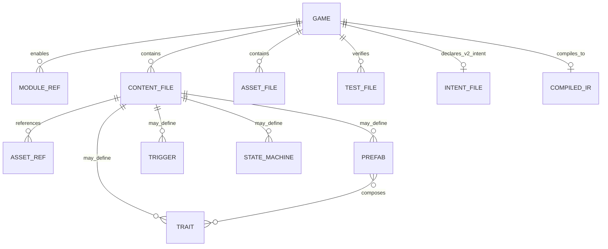

# 06 — Data model

Anvil currently supports legacy schema-v1 game packages and schema-v2 compiled
authoring packages. Runtime entities, save snapshots, observation snapshots,
and authoring IR each have their own version protocol.

## Project model



## Manifest versions

Common fields are `id`, `title`, `version`, optional engine range, `genre`,
`modules`, `entryScene`, optional seed, `contentRoot`, and `assetsRoot`.

- Schema v1 uses only the manifest/content runtime path.
- Schema v2 sets `intent` (default `game.spec.yaml`) and compiles source through
  `@anvil/authoring` when using authoring-aware tooling/runtime.
- Genres are `none`, `card`, `topdown2d`, `vn`, `shmup`, `fps2`, and `arpg`.
- The generic CLI still scaffolds v1 and does not yet invoke the v2 compiler.

The normative field contract is [`specs/S-SCHEMA.md`](./specs/S-SCHEMA.md).

## Intent and declarative source

`game.spec.yaml` contains schema version 2, summary, quality profile, player
range, platforms, and weighted verifiable requirements.

Special content directories under `contentRoot` are:

| Directory | Model |
|-----------|-------|
| `traits/` | Reusable component records plus requirements/conflicts |
| `prefabs/` | Single-parent composition and ordered traits |
| `triggers/` | Finite conditions and effect lists |
| `machines/` | Named finite states and local transitions |

Other JSON remains canonical content keyed by content-relative path.

## Authoring IR

`compileProject` returns either sorted diagnostics or a deeply frozen
`AnvilGameIR` containing manifest, intent, capability descriptors, resolved
traits/prefabs, triggers, machines, raw content, and a SHA-256 `sourceHash`.
`irVersion` is currently 1 while project `schemaVersion` is 2.

## Runtime entity model

Core uses an ECS-light entity record:

```ts
interface Entity {
  id: string;
  tags: string[];
  transform?: { x: number; y: number; z?: number; rot?: number };
  sprite?: { frames: string[]; fps: number; loop: boolean; frame?: number };
  health?: { hp: number; max: number };
  collider?: Collider;
  data: Record<string, unknown>;
}
```

Genre and engine services may retain indexed runtime state beside entities.
Public snapshots expose simplified values rather than internal objects.

## Assets

Asset references are project-relative under `assetsRoot` and may not contain
`..` or start with `/`. Missing graphics can resolve to deterministic greybox
handles in development; strict validation can require real files.

## Save protocols

Full engine saves use `SaveGame` version 1 with game id, scene, seed, entities,
and genre/character/zone hooks. ARPG titles may use `RunStateV1` for a lighter
character + area + flags continuation snapshot. Browser local-storage helpers
namespace slots as `anvil_run_<gameId>_<slot>`.

## Observation protocol

`ObserveSnapshot.schemaVersion` is currently 1 and includes engine/genre state,
summary, allowed actions, and optional screenshot. A title may put a richer
versioned contract under the genre observation; Gravewake includes authoring
hash/provenance and declarative rule state.
