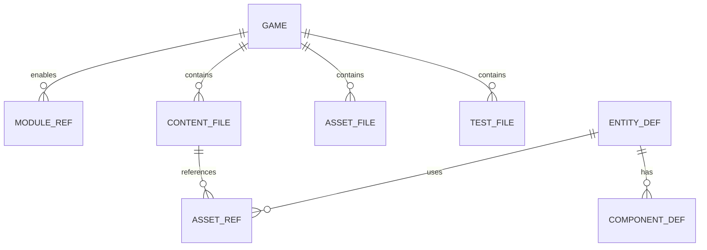

# 06 — Data Model

## 1. Game package model



### 1.1 `game.yaml`

```yaml
id: string                 # slug
title: string
version: string            # semver of game content
anvil: ">=0.1.0"           # engine range
genre: card | topdown2d | vn | shmup | fps2
modules:
  - core                   # implicit
  - genre-card             # example
entryScene: string
seed: number | null        # default test seed
contentRoot: content
assetsRoot: assets
```

### 1.2 Content files

All under `content/`, JSON, schema-validated.

| Path pattern | Purpose | Genre |
|--------------|---------|-------|
| `content/meta.json` | Display strings | all |
| `content/cards/*.json` | Card defs | card |
| `content/actors/*.json` | Actors | topdown/fps/shmup |
| `content/maps/*.json` | Maps/rooms | topdown/fps/shmup |
| `content/scripts/*.json` | Dialog graphs | vn |
| `content/waves/*.json` | Spawn waves | shmup |
| `content/weapons/*.json` | Weapons | fps2 |
| `content/audio.json` | Cue → path | all |
| `content/cinematics.json` | Video cues | all |

## 2. Runtime entity model (ECS-lite)

```ts
type EntityId = string

interface Entity {
  id: EntityId
  tags: string[]
  // core components (optional)
  transform?: { x: number; y: number; z?: number; rot?: number }
  sprite?: {
    frames: string[]      // asset paths
    fps: number
    loop: boolean
    frame?: number
  }
  health?: { hp: number; max: number }
  // extension bag for genres
  data: Record<string, unknown>
}
```

### 2.1 Component catalog (core)

| Component | Fields | Used by |
|-----------|--------|---------|
| `transform` | x,y,z?,rot? | spatial genres |
| `sprite` | frames,fps,loop | all visual |
| `health` | hp,max | combat |
| `collider` | kind, radius/w/h | topdown/fps/shmup |
| `input` | controlledBy | player |
| `lifetime` | ms | projectiles/FX |

Genre components documented in `08_GENRE_MODULES.md`.

## 3. Card domain (genre-card)

```ts
interface CardDef {
  id: string
  name: string
  cost: number
  art?: string              // asset path
  effects: Effect[]
  tags?: string[]
}

type Effect =
  | { op: 'damage'; amount: number; target: 'enemy' | 'all_enemies' | 'self' }
  | { op: 'block'; amount: number }
  | { op: 'draw'; amount: number }
  | { op: 'apply_status'; status: string; amount: number; target: string }
```

## 4. Top-down actor (genre-topdown2d)

```ts
interface ActorDef {
  id: string
  hp: number
  speed: number
  ai?: 'none' | 'chase_melee' | 'keep_distance_ranged'
  animations: Record<string, string[]>  // state → paths
  skills?: string[]
}
```

## 5. Asset references

- Always **project-relative** paths under `assetsRoot`  
- Validation: every referenced path must exist **or** greybox allowed in dev; tests may require existence via flag  

## 6. Schema packaging

- `@anvil/schema` exports Zod schemas  
- CLI validate loads schemas by genre  
- Version schemas with `schemaVersion` field in content packs  

## 7. Save model

```ts
interface SaveGame {
  v: 1
  gameId: string
  scene: string
  seed: number
  entities: Entity[]
  genreState: Record<string, unknown>
}
```
