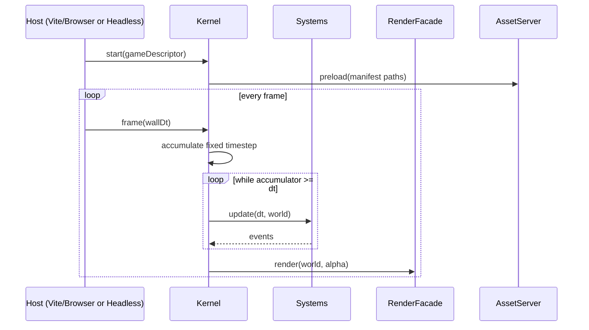
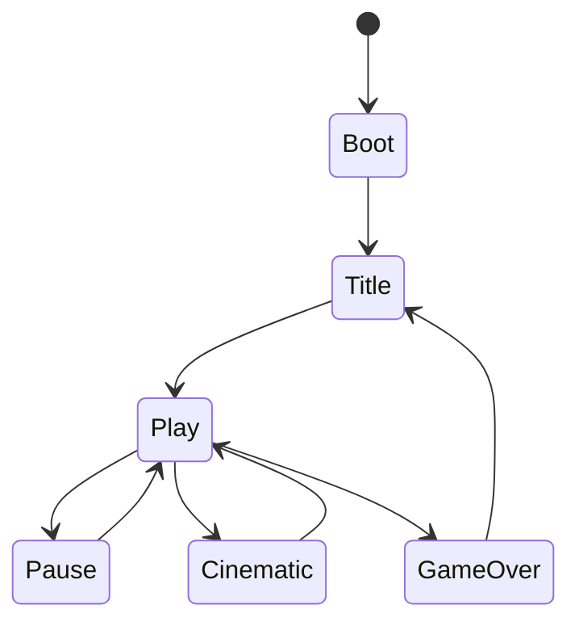

# 07 — Runtime Kernel

## 1. Main loop

## 2. Fixed timestep

- Default `dt = 1/60`  
- Max steps per frame clamp (e.g. 5) to avoid spiral of death  
- `seed` initializes RNG; tests freeze seed  

## 3. Scene lifecycle

Scenes are named strings registered by modules (`title`, `battle`, `dungeon`, …).

## 4. System order (default)

1. InputSystem  
2. GenreGameplaySystems (module-defined)  
3. Physics/Collision (if any)  
4. AnimationSystem  
5. AudioSystem  
6. Lifetime/Despawn  
7. Observe sampling (if requested)  

Modules append systems with explicit priority integers.

## 5. Render facade

Canonical: **`specs/S-RENDER.md`**.  
Implementation package: **`@anvil/render-phaser` only**.

## 6. Headless mode

- Same kernel; RenderFacade is null renderer except screenshot noop or canvas  
- `anvil test` uses headless  
- Satisfies GC “CLI/headless-friendly” preference  

## 7. Launch gate

On `anvil test` / package run:

1. Load `game.yaml`  
2. Validate  
3. Create kernel  
4. Enter `entryScene`  
5. If throw → `LAUNCH_FAIL` (GC BUILD=0 analogue)  

## 8. Performance budgets (v1 soft)

| Metric | Target |
|--------|--------|
| Entities | &lt; 500 active typical demos |
| Frame | 60 FPS demos on mid laptop |
| Observe JSON | &lt; 256KB typical |
