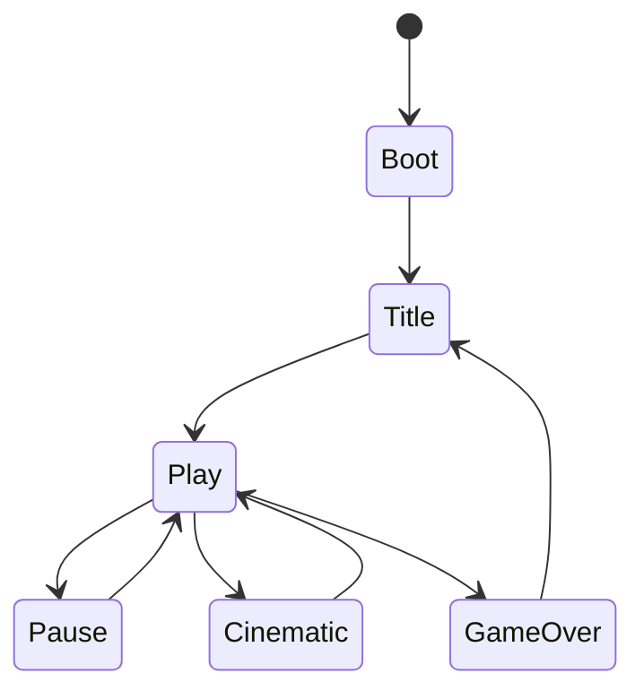

# 07 — Runtime Kernel

## 1. Main loop

```mermaid
sequenceDiagram
  participant Host as Host (Vite/Browser or Headless)
  participant K as Kernel
  participant S as Systems
  participant R as RenderFacade
  participant A as AssetServer

  Host->>K: createGame(options + loaded modules)
  K->>A: configure game/assets roots
  K->>K: register main + module scenes; enter entryScene
  loop every frame
    Host->>K: frame(wallDt)
    K->>K: accumulate fixed timestep
    loop while accumulator >= dt
      K->>S: update(dt, world)
      S-->>K: events
    end
    K->>R: render(world, alpha)
  end
```

## 2. Fixed timestep

- Default `dt = 1/60`  
- Max steps per frame clamp (e.g. 5) to avoid spiral of death  
- `seed` initializes RNG; tests freeze seed  

## 3. Scene lifecycle



Scenes are named strings registered by modules (`title`, `battle`, `dungeon`, …).

## 4. System order

Modules append systems with explicit numeric priorities; lower numbers run
first. Historical conventions place input near 0, genre work at 100–199,
collision near 200, animation near 300, audio near 400, and lifetime near 500.
First-class kernel services also update through the kernel's implemented order.
Do not depend on an undocumented relative order; choose an explicit priority or
use events/public service APIs.

## 5. Render facade

Canonical: **`specs/S-RENDER.md`**. Core supplies null and canvas facades;
`@anvil/render-phaser` is the only Phaser-backed implementation and the only
package permitted to import Phaser.

## 6. Headless mode

- Same kernel; default renderer is `NullRenderFacade`; callers may supply canvas/Phaser
- `anvil test` uses headless  
- Satisfies GC “CLI/headless-friendly” preference  

## 7. Launch gate

On `anvil test` / package run:

1. Load `game.yaml`  
2. Validate  
3. Create kernel  
4. Enter `entryScene`  
5. If throw → `LAUNCH_FAIL` (GC BUILD=0 analogue)  

Schema-v2 note: this generic launch gate currently parses `GameYamlSchema` but
does not call `compileProject`. An authoring-aware title/host must compile first
until M10 CLI integration lands.

## 8. Performance budgets (v1 soft)

| Metric | Target |
|--------|--------|
| Entities | &lt; 500 active typical demos |
| Frame | 60 FPS demos on mid laptop |
| Observe JSON | &lt; 256KB typical |
