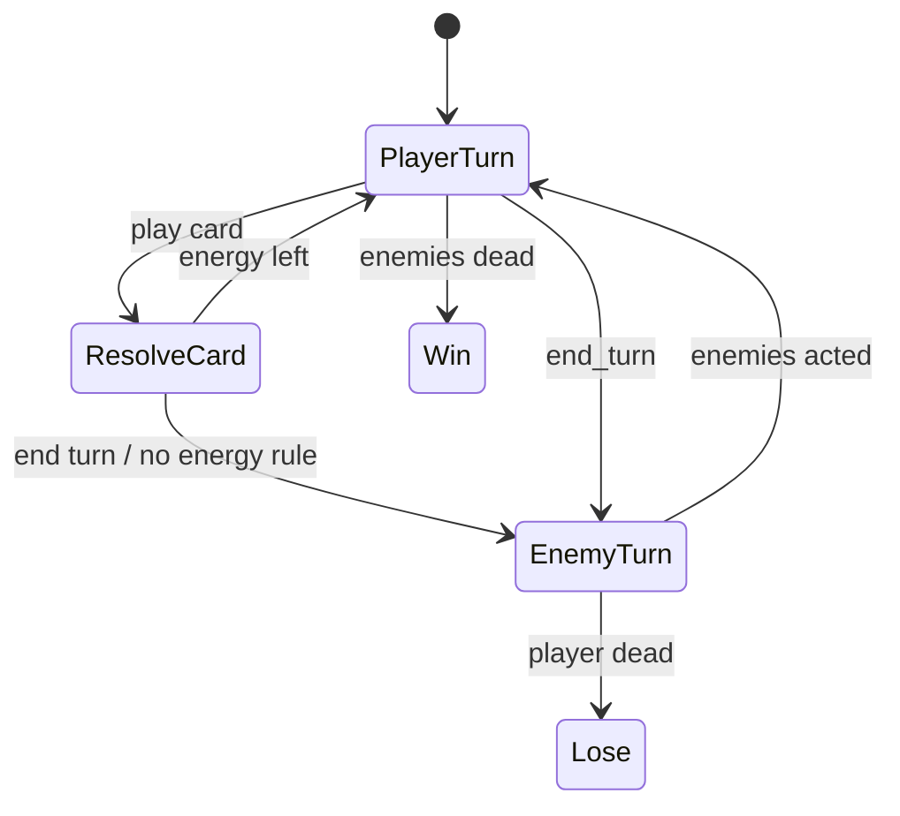

# 08 — Genre Modules

**Pattern:** DreamGarden specialized submodules (arXiv:2410.01791) — few tools with clear contracts, not full engine API.  
**Coverage:** GameCraft-Bench families map onto these modules (arXiv:2606.17861).

## 1. Module interface

```ts
interface GenreModule {
  id: string
  register(kernel: Kernel): void
  schemas(): SchemaMap
  defaultScenes(): SceneFactory[]
}
```

## 2. Module map vs GameCraft families

| Anvil module | GameCraft-ish families | Tier | Milestone |
|--------------|------------------------|------|-----------|
| genre-card | Card game, some strategy | 0 | M3 |
| genre-topdown2d | Open-world-lite, roguelike topdown, puzzle topdown | 1 | M4 |
| genre-vn | Visual novel | 1 | M5 |
| genre-shmup | Shooter (2D) | 1 | M5 |
| genre-fps2 | Shooter (Doom-like) | 2 | M7 |
| (compose) | Platformer = topdown physics variant later | 1+ | post-M5 |
| genre-net | Multiplayer families | 3 | M8 |

## 3. genre-card (REQ-G01)

### 3.1 Concepts
Deck, hand, discard, draw pile, energy/cost, enemies, turn phases.

### 3.2 State machine (battle)



### 3.3 Systems
`CardInputSystem`, `EffectResolveSystem`, `EnemyIntentSystem`, `BattleUISystem`

### 3.4 Minimum playable artifact
- 8 cards, 1 enemy, win/lose, greybox art OK  
- Tests: seed 1 always wins with scripted plays  

## 4. genre-topdown2d (REQ-G02)

### 4.1 Concepts
Transform, velocity, colliders, animation states, AI brains, map JSON (walls + spawns).

### 4.2 Systems
`MoveSystem`, `CollisionSystem`, `AnimSystem`, `AISystem`, `CombatSystem` (simple)

### 4.3 Map schema (minimal)
```json
{
  "id": "room1",
  "width": 960,
  "height": 640,
  "walls": [{ "x": 0, "y": 0, "w": 960, "h": 32 }],
  "spawns": [{ "actor": "slime", "x": 400, "y": 300 }]
}
```

### 4.4 Minimum playable
WASD player, 1 chase enemy, contact damage, restart  

## 5. genre-vn (REQ-G03)

### 5.1 Script graph
Nodes: `line` | `choice` | `jump` | `end`  
Speakers, portrait paths, background paths  

### 5.2 Minimum playable
10 lines, 1 branch, 2 endings  

## 6. genre-shmup (REQ-G04)

### 6.1 Data
Waves: time → spawn list; bullet patterns as parametric data (not free code)

### 6.2 Minimum playable
Ship move, shoot, 3 waves, lives  

## 7. genre-fps2 (REQ-G05)

### 7.1 Model
Grid map or simple sectors; camera yaw; billboard sprites; hitscan  

### 7.2 Minimum playable
Corridor, 1 enemy sprite, 1 weapon, exit  

## 8. genre-net (REQ-G06) — spike only

- Design doc for replication of transform/health  
- Local 2-peer prototype OR mock transport  
- **Not** MMO shards/auth/persistence  

## 9. Composition rules

- One primary `genre` in game.yaml  
- Additional modules only if listed and non-conflicting  
- Cross-genre events via bus only (`player_died`, `score_changed`)  

## 10. Module registration swimlane

See `12_SEQUENCES_AND_SWIMLANES.md` § Module load.
