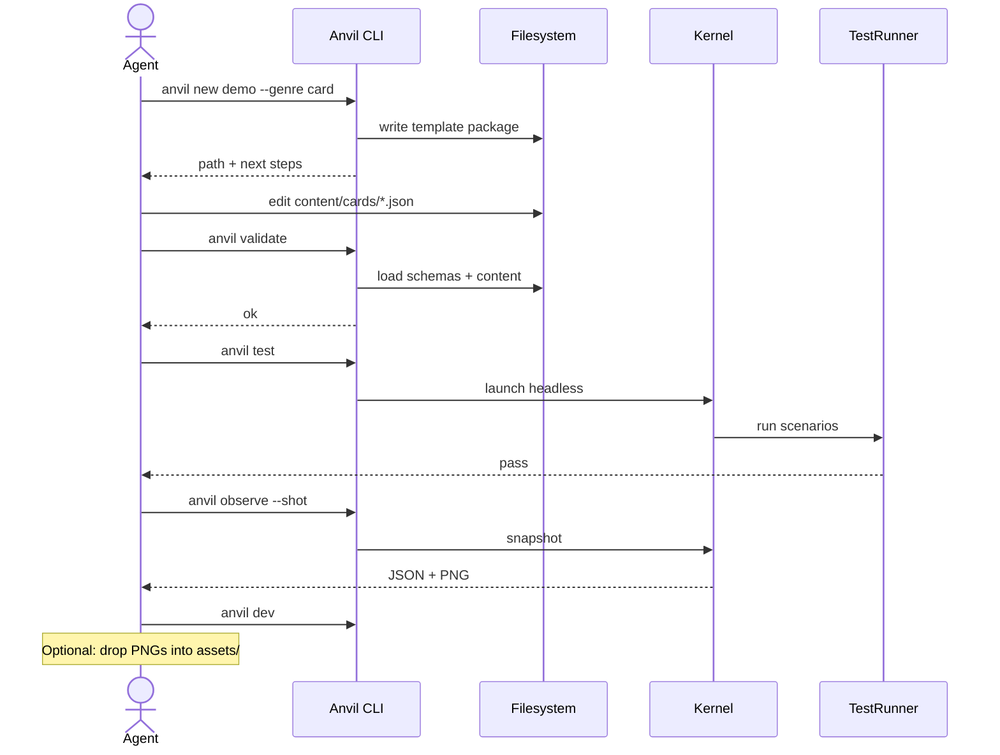
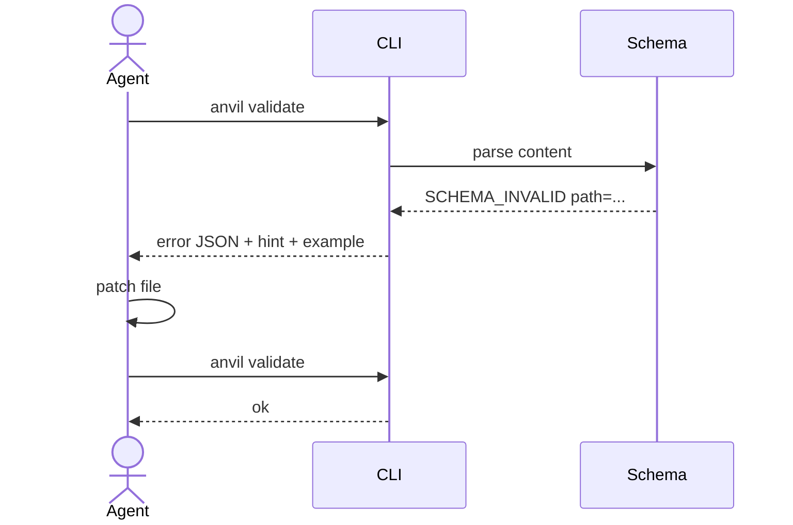
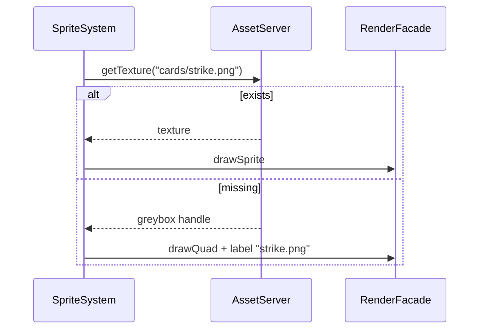
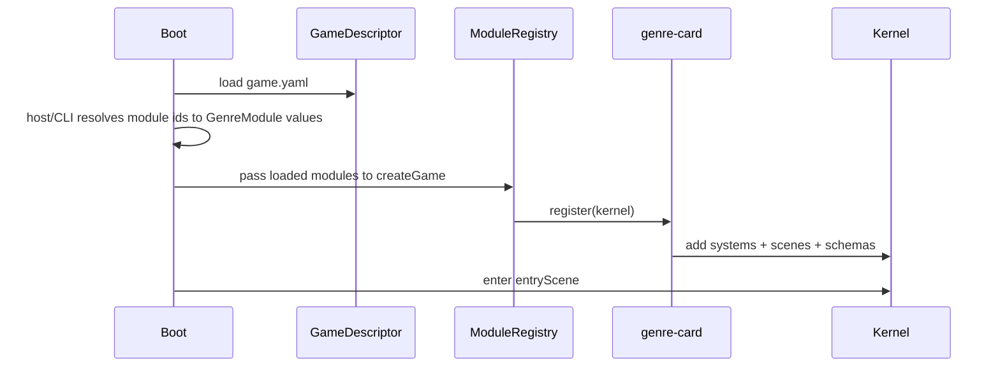
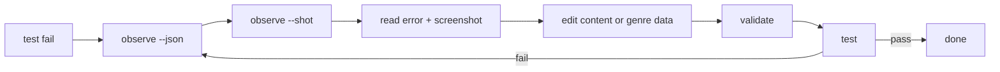
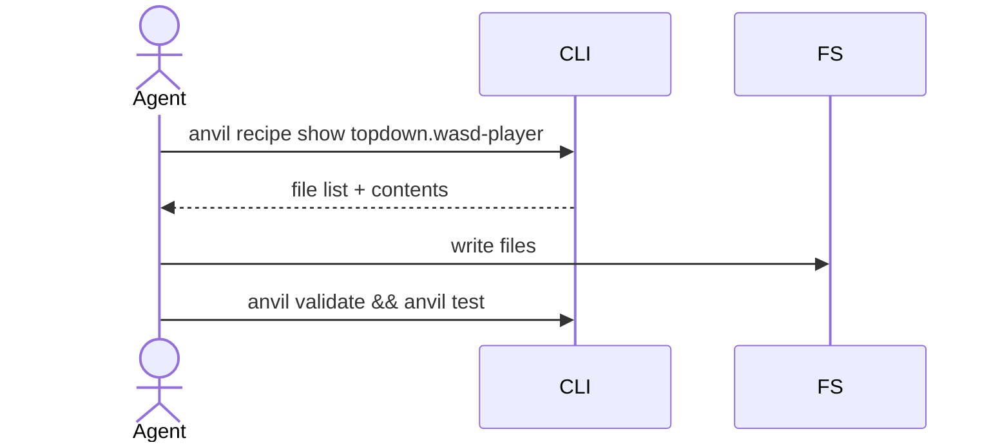
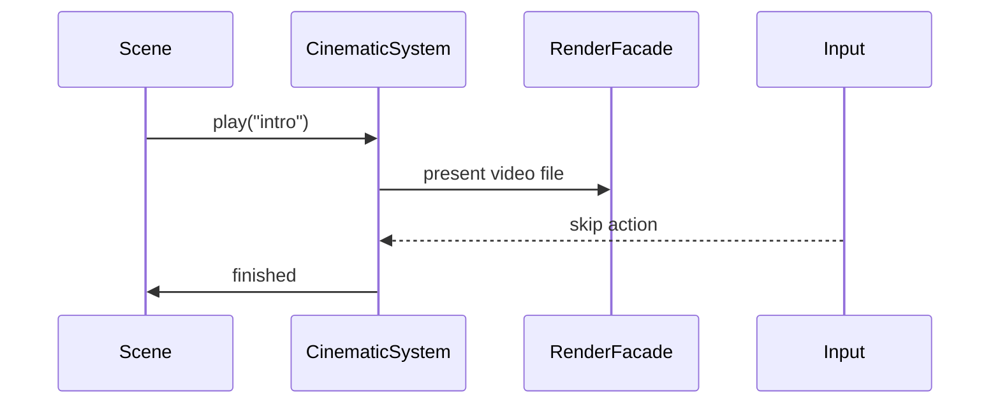
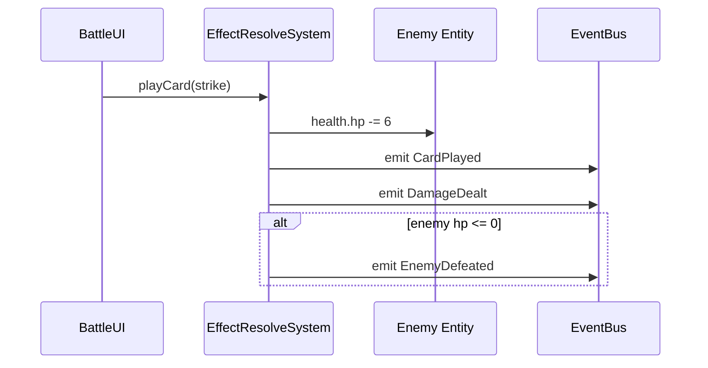
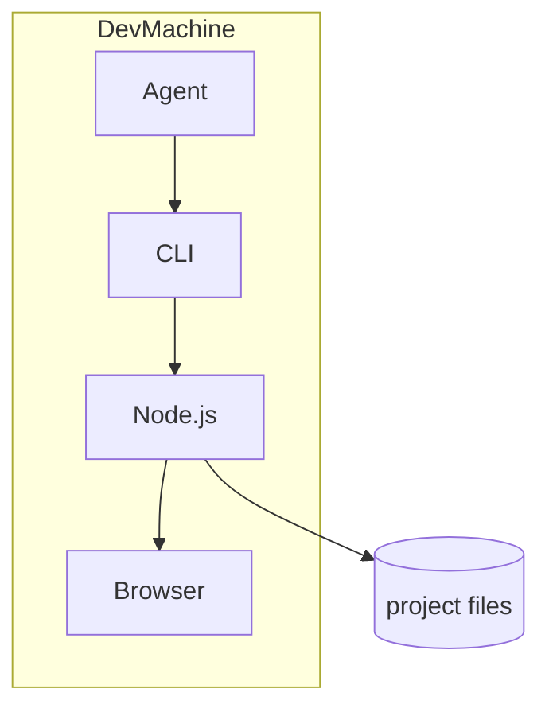
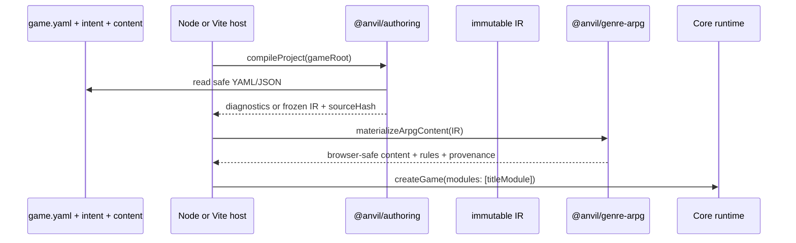

# 12 — Sequences and Swimlanes

All critical flows. Implementers must match these.

## 1. Agent builds a new card game (happy path)

## 2. Swimlane: validate fail → fix

## 3. Swimlane: missing asset greybox

## 4. Swimlane: module load at boot

The current CLI loader supports established schema-v1 genres, `genre-net`, and
relative modules. It does not yet resolve `genre-arpg` by id.

## 5. Swimlane: debug after test fail (research-aligned)

(Perception-guided iteration: GameCraft-Bench §5.1; GameDevBench visual feedback.)

## 6. Sequence: recipe apply (manual agent)

## 7. Sequence: cinematic play

## 8. Class interactions: damage effect (card)

## 9. Component diagram — deploy nodes

## 10. Schema-v2 authoring flow

In a browser build, the Vite plugin performs compilation on the host and the
browser imports `virtual:anvil-game-ir`; compiler filesystem code is excluded
from the browser graph.
