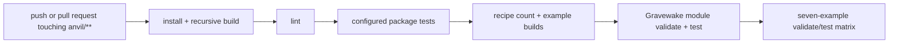

# 18 — Testing and CI

Anvil relies on deterministic unit tests, headless integrations, executable
examples, and a real title build. This file describes the commands and CI that
exist in the current checkout.

## Test layers

| Layer | Evidence | Typical command |
|-------|----------|-----------------|
| Unit | Pure systems, schemas, compilers, rules | `pnpm --filter <package> test` |
| Integration | Kernel + genre, CLI process behavior, net ops | Package test scripts |
| Example | Validate and run scenario files | `pnpm validate:examples && pnpm test:examples` |
| Title | Gravewake headless regressions, lint, web build | `pnpm test:gravewake`; title commands |
| Repository | Build, all configured tests, lint, examples, title, browser | `pnpm check` |

All headless tests use fixed timesteps and deterministic seeds where random
behavior matters. Avoid wall-clock assertions.

## Milestone coverage

| Milestone | Primary executable evidence |
|-----------|-----------------------------|
| M1 | empty launch, validation, scenario exit, observe shape |
| M2 | missing asset, greybox, screenshot, media, save/load |
| M3 | card scripted win and invalid content rejection |
| M4 | top-down movement, collision, AI, projectile behavior |
| M5 | VN branch and shmup wave/pattern behavior |
| M6 | CLI/build/error and all-example matrix |
| M7 | FPS movement/raycast/hitscan example |
| M8 | loopback/raw-WS spike plus Colyseus security/ops/integration |
| M9 | Gravewake movement, instances, inventory, progression, combat |
| M10 | compiler/migration/Vite/capability tests plus pending CLI integration |
| M11 | ARPG materializer/rule/hook tests plus Gravewake IR regressions |

## Local commands and current results

From `anvil/`:

```bash
pnpm -r run build
pnpm test
pnpm --filter @anvil/authoring --filter @anvil/genre-arpg test
pnpm lint
pnpm validate:examples
pnpm test:examples
pnpm validate:gravewake
pnpm test:gravewake
pnpm --dir ../games/gravewake lint
pnpm --dir ../games/gravewake build:web
```

Important script boundary:

- `pnpm test` explicitly filters the established packages and currently omits
  `@anvil/authoring` and `@anvil/genre-arpg`.
- It still includes `@anvil/cli`, whose M10/M11 integration tests currently
  fail three cases.
- Running the two new package tests directly currently passes 13 tests.
- `pnpm check` is the intended aggregate gate and currently fails at the CLI
  integration step. It must remain visible until the missing work lands.

## GitHub Actions workflow

The live workflow is [`.github/workflows/ci.yml`](../../../.github/workflows/ci.yml).
It uses Node 22 and pnpm 9.

`build-test` currently runs:

1. install and recursive build;
2. lint and the configured root test suite;
3. recipe count of at least 15;
4. static builds for hello-empty and hello-card;
5. Gravewake module build; and
6. Gravewake CLI validate and test.

The example matrix validates and tests `hello-empty`, `hello-card`,
`hello-topdown`, `hello-vn`, `hello-shmup`, `hello-fps2`, and `hello-net`.

Known CI coverage gaps:

- workflow path filters trigger only for `anvil/**` and the workflow file, so
  a game-only change does not run CI;
- the workflow inherits the root test omission of authoring/ARPG package tests;
- it does not run Gravewake lint or the browser production build; and
- with the current CLI integration failures, `build-test` is not green.

## Failure investigation order

1. Run the smallest failing package test directly.
2. For a game/example, run `validate`, then `test --json`.
3. Use `observe --json` or `observe --shot` to inspect runtime state.
4. Rebuild dependency packages before judging a CLI failure.
5. Run the aggregate gate only after the targeted failure is understood.

Never delete or skip a test merely because it exposes a documented pending
milestone. Either implement the promised surface or keep the failure/status
explicit.

## CI flow


