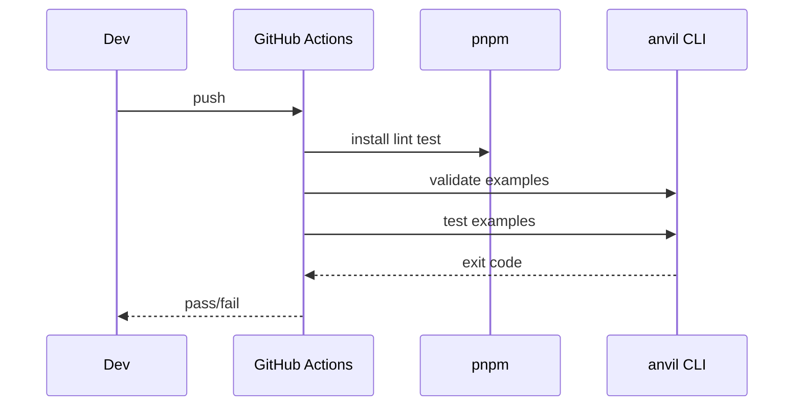

# 18 — Testing and CI Plan

**Research:** GameCraft interactive verification; GameGen-Verifier runtime checks; deterministic seeds.

## 1. Test pyramid

| Level | What | Tool | When |
|-------|------|------|------|
| Unit | pure functions, schema parse, effect resolve | Vitest | every PR |
| Integration | kernel + one genre, headless ticks | Vitest | every PR |
| Package | `anvil validate` + `anvil test` on examples | CLI | every PR |
| Manual | `anvil dev` smoke | human/agent | milestone exit |

## 2. Required tests by milestone

| M | Must pass |
|---|-----------|
| M1 | hello-empty launches; validate ok; observe JSON shape; one failing test fixture proves non-zero exit |
| M2 | missing asset greybox; assets missing lists path |
| M3 | hello-card scripted win; schema reject bad card |
| M4 | hello-topdown player moves; enemy damages |
| M5 | vn branch; shmup wave spawn |
| M6 | all examples in CI matrix green |
| M7 | fps2 shoot enemy |

## 3. Determinism

- All scenario tests set `seed`  
- No wall-clock assertions  
- Fixed `dt` in headless  

## 4. CI workflow (GitHub Actions)

Live workflow: **repo root** `.github/workflows/ci.yml`

- Job `build-test`: install, build, lint, unit tests, recipe count ≥15, `anvil build` smoke  
- Job `examples` **matrix**: `hello-empty`, `hello-card`, `hello-topdown`, `hello-vn`, `hello-shmup` → validate + test each  

Headless: JSON observe always; screenshot optional (`--shot`).

## 5. Coverage

- No hard % gate in M1  
- M6: fail PR if example tests fail (coverage optional)

## 6. Diagram — CI swimlane

