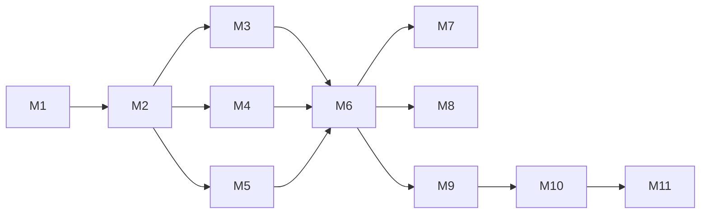

# 20 — Full task breakdown and implementation status

**Spec-driven development:** this file is the implementation plan and current
status for M1–M11.
Agents implement tasks in order within a milestone; do not skip dependencies.  
Format inspired by GitHub Spec Kit `tasks` phase + SDD (arXiv:2602.00180).

**Status legend:** `[ ]` todo · `[x]` done · `[-]` cancelled

---

## M1 — Kernel + ACI + monorepo

| ID | Task | Depends | Spec | Status |
|----|------|---------|------|
| T-M1-001 | Create pnpm workspace root (`package.json`, `pnpm-workspace.yaml`, `tsconfig.base.json`) | — | 17 | **[x]** |
| T-M1-002 | Create `@anvil/schema` package + Zod for `game.yaml` | T-M1-001 | 06, S-SCHEMA | **[x]** |
| T-M1-003 | Create `@anvil/core` skeleton: Kernel, World, Entity, EventBus | T-M1-001 | 07, S-CORE | **[x]** |
| T-M1-004 | SceneManager push/pop/replace | T-M1-003 | 07 | **[x]** |
| T-M1-005 | InputMap + default key bindings (S-CORE §6) | T-M1-003 | S-CORE, S-TEST | **[x]** |
| T-M1-005b | ModuleRegistry + addSystem priorities | T-M1-003 | S-CORE | **[x]** |
| T-M1-005c | Seeded RNG random/randomInt + pause freezes sim | T-M1-003 | S-CORE | **[x]** |
| T-M1-006 | AssetServer path resolve + greybox handle | T-M1-003 | S-ASSETS | **[x]** |
| T-M1-007 | RenderFacade interface + `@anvil/render-phaser` stub clear/quad/text | T-M1-003 | S-RENDER | **[x]** (NullRenderFacade; Phaser later) |
| T-M1-008 | Fixed timestep game loop wired to facade | T-M1-004,007 | 07 | **[x]** |
| T-M1-009 | `createGame` / `GameHandle` public API | T-M1-008 | S-CORE | **[x]** |
| T-M1-010 | `validateProject` CLI+lib | T-M1-002 | 05 | **[x]** |
| T-M1-011 | `runTests` headless + JSON scenario runner | T-M1-009 | 10, 18 | **[x]** |
| T-M1-012 | `observe` JSON snapshot | T-M1-009 | 10 | **[x]** |
| T-M1-013 | `@anvil/cli` bin: new, validate, dev, test, observe, version | T-M1-010..012 | 05 | **[x]** |
| T-M1-014 | `anvil new` empty genre template `hello-empty` | T-M1-013 | 17 | **[x]** |
| T-M1-015 | Vite `anvil dev` for hello-empty | T-M1-014 | 17 | **[x]** Canvas + Vite browser |
| T-M1-016 | Error JSON format + codes enum | T-M1-010 | S-ERRORS | **[x]** |
| T-M1-017 | ESLint ban phaser outside render-phaser | T-M1-001 | 17 | **[x]** |
| T-M1-018 | Root CI workflow install+test+validate hello-empty | T-M1-014,011 | 18 | **[x]** |
| T-M1-019 | LICENSE MIT | T-M1-001 | GAP-04 | **[x]** |
| T-M1-020 | M1 acceptance: P01–P07, K01–K07, K12, A01–A03 green (P08 is M2) | T-M1-018 | 14 | **[x]** |

---

## M2 — Assets + media

| ID | Task | Depends | Spec | Status |
|----|------|---------|------|--------|
| T-M2-001 | Load png/webp/jpg via AssetServer | M1 | 09 | **[x]** |
| T-M2-002 | drawSprite on facade | T-M2-001 | S-RENDER | **[x]** |
| T-M2-003 | Greybox when missing + one-time log | T-M2-001 | 09 | **[x]** |
| T-M2-004 | `anvil assets missing` | T-M2-001 | 05 | **[x]** |
| T-M2-005 | Audio cue table + play | T-M2-001 | 09 | **[x]** |
| T-M2-006 | CinematicSystem video file play/skip/loop | T-M2-001 | 09, 12 | **[x]** |
| T-M2-007 | (see T-M2-008d) observe shot | T-M2-002 | 10 | **[x]** |
| T-M2-008 | AnimationSystem frame lists | T-M2-002 | 06 | **[x]** |
| T-M2-008b | saveGame/loadGame + tests (REQ-K11) | T-M2-001 | S-SAVE, S-CORE | **[x]** |
| T-M2-008c | optional assets/manifest.yaml validate (S04) | T-M2-004 | S-ASSETS | **[x]** |
| T-M2-008d | observe --shot PNG (P08) | T-M2-002 | 10, S-CORE | **[x]** |
| T-M2-009 | M2 acceptance: P08–P09, K08–K11, S01–S04 | T-M2-008d | 14 | **[x]** |

---

## M3 — genre-card + recipes

| ID | Task | Depends | Spec | Status |
|----|------|---------|------|--------|
| T-M3-001 | `@anvil/genre-card` package register | M2 | S-CARD, 08 | **[x]** |
| T-M3-002 | CardDef schema + effects: damage, block, draw, apply_status | T-M3-001 | S-CARD | **[x]** |
| T-M3-003 | Battle state machine PlayerTurn/EnemyTurn/Win/Lose | T-M3-002 | S-CARD | **[x]** |
| T-M3-004 | Hand/draw/discard piles logic | T-M3-003 | S-CARD | **[x]** |
| T-M3-005 | Energy/cost rules | T-M3-004 | S-CARD | **[x]** |
| T-M3-006 | Enemy intent + act | T-M3-003 | S-CARD | **[x]** |
| T-M3-007 | Battle UI (code-drawn) | T-M3-005 | S-CARD | **[x]** |
| T-M3-008 | examples/hello-card content + art greybox | T-M3-007 | 11 | **[x]** |
| T-M3-009 | Scripted test: win with seed 1 | T-M3-008 | 18 | **[x]** |
| T-M3-010 | Recipes card.* **exactly 5 ids from 11** with full bodies | T-M3-008 | 11, S-RECIPES | **[x]** |
| T-M3-011 | `anvil recipe list/show` | T-M3-010 | 05 | **[x]** |
| T-M3-012 | template card-starter | T-M3-008 | 11 | **[x]** |
| T-M3-013 | M3 acceptance | T-M3-012 | 14 | **[x]** |

---

## M4 — genre-topdown2d

| ID | Task | Depends | Spec | Status |
|----|------|---------|------|--------|
| T-M4-001 | `@anvil/genre-topdown2d` package | M2 | S-TOPDOWN | **[x]** |
| T-M4-002 | Transform + velocity move | T-M4-001 | S-TOPDOWN | **[x]** |
| T-M4-003 | AABB/circle collision resolve (separate axis) | T-M4-002 | S-TOPDOWN | **[x]** |
| T-M4-004 | Map JSON walls + spawns load | T-M4-003 | S-TOPDOWN | **[x]** |
| T-M4-005 | AI chase_melee | T-M4-004 | S-TOPDOWN | **[x]** |
| T-M4-006 | AI keep_distance_ranged + projectile | T-M4-005 | S-TOPDOWN | **[x]** |
| T-M4-007 | Contact damage + i-frames player | T-M4-005 | S-TOPDOWN | **[x]** |
| T-M4-008 | Animation state machine idle/walk/attack | T-M4-002 | S-TOPDOWN | **[x]** |
| T-M4-009 | hello-topdown + tests | T-M4-008 | 18 | **[x]** |
| T-M4-010 | Recipes topdown.* (5) | T-M4-009 | 11 | **[x]** |
| T-M4-011 | template topdown-starter | T-M4-009 | 11 | **[x]** |
| T-M4-012 | M4 acceptance | T-M4-011 | 14 | **[x]** |

---

## M5 — genre-vn + genre-shmup

| ID | Task | Depends | Spec | Status |
|----|------|---------|------|--------|
| T-M5-001 | `@anvil/genre-vn` script graph interpreter | M2 | S-VN | **[x]** |
| T-M5-002 | line/choice/jump/end + portraits/bg | T-M5-001 | S-VN | **[x]** |
| T-M5-003 | hello-vn + test branch | T-M5-002 | 18 | **[x]** |
| T-M5-004 | recipes vn.* **≥2** (vn.linear-scene, vn.two-choice) | T-M5-003 | 11 | **[x]** |
| T-M5-005 | `@anvil/genre-shmup` scroll + ship | M2 | S-SHMUP | **[x]** |
| T-M5-006 | Wave spawner data | T-M5-005 | S-SHMUP | **[x]** |
| T-M5-007 | Bullet pattern DSL (linear, aim, fan) | T-M5-006 | S-SHMUP | **[x]** |
| T-M5-008 | Lives / score / game over | T-M5-007 | S-SHMUP | **[x]** |
| T-M5-009 | hello-shmup + tests | T-M5-008 | 18 | **[x]** |
| T-M5-010 | recipes shmup.* **≥3** | T-M5-009 | 11 | **[x]** |
| T-M5-011 | templates vn-starter, shmup-starter | T-M5-004,010 | 11 | **[x]** |
| T-M5-012 | Total recipes ≥ 15 | T-M5-010 | 11 | **[x]** |
| T-M5-013 | M5 acceptance | T-M5-012 | 14 | **[x]** |

---

## M6 — Agent-ready polish

| ID | Task | Depends | Spec | Status |
|----|------|---------|------|--------|
| T-M6-001 | Root + anvil AGENTS.md commands match reality | M5 | AGENTS.md | **[x]** |
| T-M6-002 | CI matrix all examples | M5 | 18 | **[x]** |
| T-M6-003 | Exhaustive error codes documented + tested | M5 | S-ERRORS | **[x]** |
| T-M6-004 | `anvil build` static export | M5 | 05 | **[x]** |
| T-M6-005 | Performance smoke (entity budget) | M5 | 07 | **[x]** |
| T-M6-006 | Docs sync: any API drift fixed | T-M6-004 | 14 | **[x]** |
| T-M6-007 | M6 acceptance: agent-ready | T-M6-006 | 14 | **[x]** |

---

## M7 — genre-fps2

| ID | Task | Depends | Spec | Status |
|----|------|---------|------|--------|
| T-M7-001 | `@anvil/genre-fps2` package | M6 | S-FPS2 | **[x]** |
| T-M7-002 | Grid map + DDA raycast walls | T-M7-001 | S-FPS2 | **[x]** |
| T-M7-003 | Player move + yaw | T-M7-002 | S-FPS2 | **[x]** |
| T-M7-004 | Billboard enemies | T-M7-003 | S-FPS2 | **[x]** |
| T-M7-005 | Hitscan weapon | T-M7-004 | S-FPS2 | **[x]** |
| T-M7-006 | hello-fps2 + tests | T-M7-005 | 18 | **[x]** |
| T-M7-007 | template fps2-starter | T-M7-006 | 11 | **[x]** |
| T-M7-008 | M7 acceptance | T-M7-007 | 14 | **[x]** |

---

## M8 — Net spike

| ID | Task | Depends | Spec | Status |
|----|------|---------|------|--------|
| T-M8-001 | Confirm/extend existing `specs/S-NET.md` for loopback harness | M6 | S-NET | **[x]** |
| T-M8-002 | Transport interface + loopback mock | T-M8-001 | S-NET | **[x]** |
| T-M8-003 | Replicate transform+health for 2 peers | T-M8-002 | S-NET | **[x]** |
| T-M8-004 | Demo or documented spike only | T-M8-003 | 13 | **[x]** |
| T-M8-005 | M8 acceptance (spike, not production MMO) | T-M8-004 | 14 | **[x]** |

---

## M9 — First real game (post-engine)

| ID | Task | Depends | Spec | Status |
|----|------|---------|------|--------|
| T-M9-001 | Unpark game decision (Gravewake or other) | M6+ | games/gravewake/PARKED | **[x]** Gravewake |
| T-M9-002 | Implement game **only** on Anvil APIs under `games/` | T-M9-001 | games/gravewake docs | **[x]** |
| T-M9-003 | Playable campaign content + tests + first production asset pass | T-M9-002 | Gravewake operational docs | **[x]** |
| T-M9-004 | Harden procedural instance entry + interactive paper-doll/backpack inventory | T-M9-003 | S-RPG, S-TOPDOWN | **[x]** |
| T-M9-005 | Guarantee connected procedural landmarks, corridor clearance, and path feedback | T-M9-004 | S-TOPDOWN | **[x]** |

---

## M10 — Schema-v2 agent-native authoring

Library implementation is present, but the CLI migration and default-project
cutover are not complete. See [`specs/S-AUTHORING.md`](./specs/S-AUTHORING.md).

| ID | Task | Depends | Spec | Status |
|----|------|---------|------|--------|
| T-M10-001 | Add schema-v2 manifest fields and `game.spec.yaml` intent contract | M9 | S-SCHEMA, S-AUTHORING | **[x]** |
| T-M10-002 | Add trait, prefab, trigger, effect, and state-machine schemas | T-M10-001 | S-AUTHORING | **[x]** |
| T-M10-003 | Implement deterministic `compileProject` and deeply frozen canonical IR | T-M10-002 | S-AUTHORING | **[x]** |
| T-M10-004 | Implement prefab merge, reference, cycle, requirement, and conflict diagnostics | T-M10-003 | S-AUTHORING, S-ERRORS | **[x]** |
| T-M10-005 | Implement transactional, idempotent `migrateProject` library API | T-M10-001 | S-AUTHORING | **[x]** |
| T-M10-006 | Implement capability catalog and per-project descriptors | T-M10-003 | S-AUTHORING | **[x]** |
| T-M10-007 | Implement Vite `virtual:anvil-game-ir` bridge | T-M10-003 | S-AUTHORING | **[x]** |
| T-M10-008 | Wire CLI `migrate`, `describe`, and `capabilities` with JSON output | T-M10-005,006 | S-CLI, S-AUTHORING | **[ ]** |
| T-M10-009 | Make `anvil new` emit schema v2 plus an intent file | T-M10-005 | S-CLI, S-AUTHORING | **[ ]** |
| T-M10-010 | Migrate active examples and templates to schema v2 | T-M10-009 | S-AUTHORING, 11 | **[ ]** |
| T-M10-011 | Integrate authoring compilation with generic validate/test/dev paths | T-M10-003,008 | S-CLI, S-TEST | **[ ]** |
| T-M10-012 | Include authoring tests in the root `pnpm test` suite | T-M10-003 | 18 | **[ ]** |
| T-M10-013 | M10 acceptance: CLI integration tests and complete repository gate pass | T-M10-008..012 | 14, 18 | **[ ]** |

---

## M11 — Declarative ARPG runtime and Gravewake integration

The package and title integration are implemented. Generic CLI loading and
scaffolding remain pending. See [`specs/S-ARPG.md`](./specs/S-ARPG.md).

| ID | Task | Depends | Spec | Status |
|----|------|---------|------|--------|
| T-M11-001 | Create `@anvil/genre-arpg` and deterministic IR materialization | M10 compiler | S-ARPG | **[x]** |
| T-M11-002 | Implement finite deterministic `ArpgRuleRuntime` | T-M11-001 | S-ARPG, S-AUTHORING | **[x]** |
| T-M11-003 | Implement `defineArpgGame` restricted title hook | T-M11-001 | S-ARPG | **[x]** |
| T-M11-004 | Compile Gravewake through the same IR in Node and Vite/browser | T-M11-001 | S-ARPG | **[x]** |
| T-M11-005 | Author Gravewake archetypes, campaign rules, and observation provenance | T-M11-002,004 | S-ARPG | **[x]** |
| T-M11-006 | Add `genre-arpg` to the generic CLI module loader | T-M11-001 | S-CLI, S-ARPG | **[ ]** |
| T-M11-007 | Add a schema-v2 `anvil new --genre arpg` starter | T-M10-009,T-M11-006 | S-CLI, S-ARPG | **[ ]** |
| T-M11-008 | Include ARPG tests in root `pnpm test` and CI paths | T-M11-001 | 18 | **[ ]** |
| T-M11-009 | M11 acceptance: generic ARPG scaffold plus complete repository gate pass | T-M11-006..008 | 14, 18 | **[ ]** |

---

## Dependency overview

## How an agent uses this file

1. Find the first `[ ]` task whose dependencies are done.
2. Read linked Spec.  
3. Implement.  
4. Run tests for that milestone.  
5. Mark `[x]`.  
6. Stop at milestone boundary unless told to continue.
