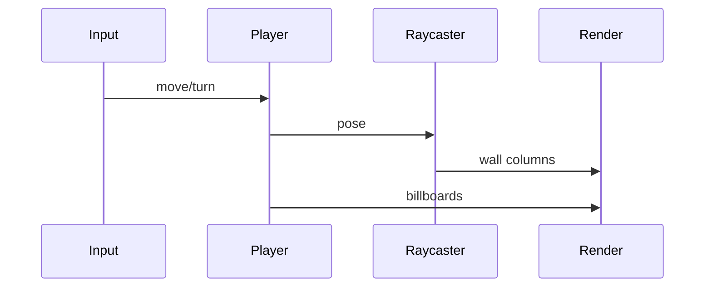

# Spec: genre-fps2 Doom-like (complete behavior)

**Milestone:** M7

## 1. Map

2D grid `cells[y][x]` = 0 empty / >0 wall texture id  
Player pose: `x, y, angle` (radians)

## 2. Raycast (DDA)

For each screen column:

1. Ray from player angle + fov offset  
2. DDA through grid until wall  
3. Distance → wall slice height  
4. Draw vertical strip (texture u from hit)  

## 3. Entities

Billboards: enemy positions projected to screen by angle/distance; draw sprite scaled by 1/z.

## 4. Combat

Hitscan: ray from player; first enemy within aim cone + maxDist takes damage.

## 5. Input

`move_forward/back/left/right`, `turn_left/right`, `shoot`

## 6. Tests

- Wall blocks movement  
- Ray hits wall (integration smoke)  
- Shoot damages enemy in front  

## 7. Sequence

