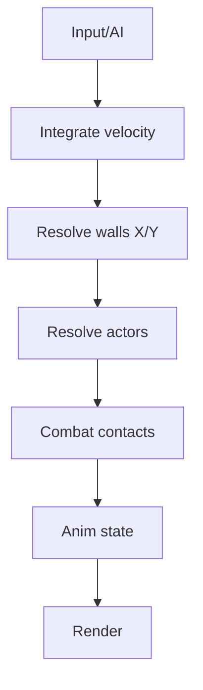

# Spec: genre-topdown2d (complete behavior)

**Milestone:** M4

## 1. Movement

- Velocity from input or AI; `pos += vel * dt`  
- Speed from actor def  

### Player input (S-CORE)

| Action | Effect |
|--------|--------|
| `move_up` | vy -= speed |
| `move_down` | vy += speed |
| `move_left` | vx -= speed |
| `move_right` | vx += speed |

Normalize diagonal to speed length.
`TopdownSimOptions.inputSpace: "isometric"` rotates directional input so WASD
tracks screen-up/down/left/right while the simulation remains cartesian.

Portal, save, and procedural-map coordinates MUST be resolved through
`TopdownSim.resolveWalkablePoint` / `teleportPlayer`; a blocked destination is
moved to nearby navigable space and MUST NOT snap a path back into collision.
Generated dungeon entrances and required gameplay points MUST be carved into
the connected room graph. Navigation occupancy MUST use cell-center clearance,
not whole-cell overlap inflation that can seal valid corridors.

## 2. Collision (normative algorithm)

Walls: map `walls[]` rectangles. Default collider: circle r=12.

1. Integrate **X** only; resolve each wall: if overlap, clamp position onto wall face; zero vx.  
2. Integrate **Y** only; same for walls; zero vy.  
3. Circle-circle actors:
```
delta = posA - posB; dist = |delta|
if 0 < dist < rA+rB:
  n = delta/dist; push = (rA+rB-dist)/2
  posA += n*push; posB -= n*push  // skip B if tag immovable
```

## 3. Combat v1

- Contact damage: if dist < r1+r2 and team enemy, apply damage once per `contactCooldownMs` (500).  
- Player i-frames `iframeMs` (300) after hit.  
- Optional projectile: spawn entity with velocity, damage on hit, lifetime.  

## 4. AI

| id | Behavior |
|----|----------|
| `none` | idle |
| `chase_melee` | seek player; stop at melee range |
| `keep_distance_ranged` | maintain band; fire projectile on cooldown |

## 5. Animation states

Priority: death > attack > walk (if speed>epsilon) > idle  
Flip X from velocity.x sign.

## 6. Map JSON

```json
{
  "id": "string",
  "width": number,
  "height": number,
  "walls": [{ "x", "y", "w", "h" }],
  "spawns": [{ "actor": "id", "x", "y", "team": "player"|"enemy" }],
  "background": "optional/path.png"
}
```

## 7. Observe

entities with transform, health, tags.

## 8. Required tests

- Player cannot walk through wall  
- Chase enemy reduces distance  
- Contact damages player  
- Seed-stable spawn positions  

## 9. Activity diagram


